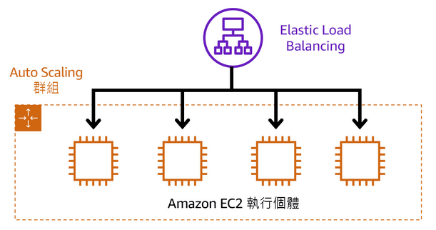
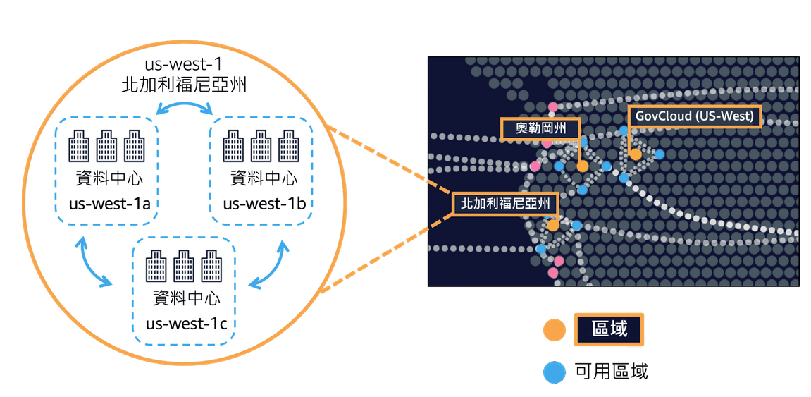

# AWS Cloud Practitioner
# Amazon Web Services簡介
## 用戶端 - 伺服器模型

### 雲端運算的部署模型
>
>- ***雲端部署*** - 在雲端中執行完整的應用程式。 
>- ***內部部署*** - 透過虛擬化和資源管理工具來部署資源。
>- ***混合部署*** - 將雲端資源連接到內部部署基礎設施。

### 雲端運算的優勢
>- 將預付費用轉變成變動費用
>- 不必將資金花費在執行和維護資料中心上
>- 無需猜測容量
>- 受益於大範圍規模經濟
>- 提高速度和敏捷性
>- 快速進入全球市場

# 雲端中的運算
## Amazon EC2 執行個體類型
>- ***一般用途*** - 一般用途的執行個體可平衡運算、記憶體與網路資源，也可用於各種工作負載。
>- ***運算優化*** - 運算最佳化的執行個體非常適合運算密集型應用，這類應用可受惠於高效能處理器。
>- ***記憶體最佳化*** - 記憶體最佳化執行個體是為交付於記憶體內部處理大型資料集之工作負載的快速效能而設計的。
>- ***儲存最佳化*** - 最佳化儲存執行個體專為需要對本機儲存上的超大型資料集進行高序列讀取及寫入存取的工作量所設計，這些執行個體經過最佳化，能為應用程式提供每秒數萬次低延遲隨機的 I/O 操作 (IOPS)。
>- ***加速運算執行個體*** - 使用硬體加速器或協同處理器來提高執行某些功能的效率，適合圖形應用程式、遊戲串流和應用程式串流等。

## Amazon EC2 定價
>- ***隨需執行個體*** - 不可中斷的短期不定期工作負載，無需預付費用或最低合約。按照使用的運算時間付費。
>- ***Amazon EC2 Savings Plans*** - 承諾在 1 年或 3 年期限內維持一致的運算用量，以此降低運算成本。這種限期承諾比起隨需付費，可節省高達 72% 的成本。
>- ***預留執行個體*** - 一種計費折扣方式，依您帳戶中的隨需執行個體用量而定。
>- ***Spot執行個體*** - 適合啟動和結束時間較彈性或可承受中斷的工作負載。Spot 執行個體利用未使用的 Amazon EC2 運算容量，節省最多達 90% 的成本。
>- ***專用主機*** - 完全專供您使用且含有 Amazon EC2 執行個體容量的實體伺服器。 

## Amazon EC2 Auto Scaling
在 Amazon EC2 Auto Scaling 中，您可以使用兩種方法：動態擴展和預測性擴展。
>- ***動態調整*** - 可因應不斷變化的需求， 
>- ***預測性擴展*** - 則會根據預測的需求自動安排適當數量的 Amazon EC2 執行個體。
 

## Elastic Load Balancing
Elastic Load Balancing 是一種可在多個資源 (例如 Amazon EC2 執行個體) 之間自動分配傳入應用程式流量的 AWS 服務。

## AWS 內建服務
>- ***Amazon Simple Notification Service (Amazon SNS)*** - 發布/訂閱服務，將訊息發布給訂閱者。
>- ***Amazon Simple Queue Service (Amazon SQS)*** - 訊息佇列服務，應用程式會將訊息傳送到佇列中。使用者或服務會從佇列擷取訊息。
>- ***AWS Lambda*** - 無需佈建或管理伺服器即可執行程式碼的服務，只需根據所用運算時間付費。
>- ***Amazon Elastic Container Service (Amazon ECS)*** - 可高度擴展的高效能容器管理系統，支援 Docker 容器。
>- ***Amazon Elastic Kubernetes Service (Amazon EKS)*** -  AWS 上執行 Kubernetes。
>- ***AWS Fargate*** - 是無伺服器，依用量計費的運算引擎，讓您專注於建置應用程式，而無需管理伺服器。AWS Fargate 與 Amazon Elastic Container Service (ECS) 和 Amazon Elastic Kubernetes Service (EKS) 相容。

# 全球基礎設施與可靠性
## 區域(Regions) & 可用區域(Availability Zones)

>- ***區域(Regions)*** - 各個區域為獨立的地理區域。
>- ***可用區域(Availability Zones)*** - 可用區域是每個區域內的多個隔離位置。

## 選取區域
- 符合資料管理和法律要求
- 接近您的客戶
- 區域內的可用服務
- 定價