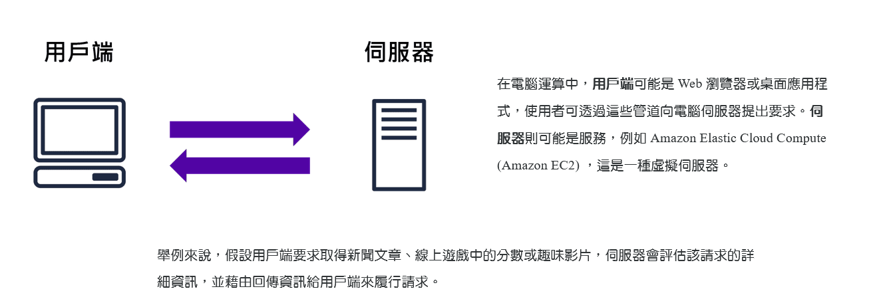
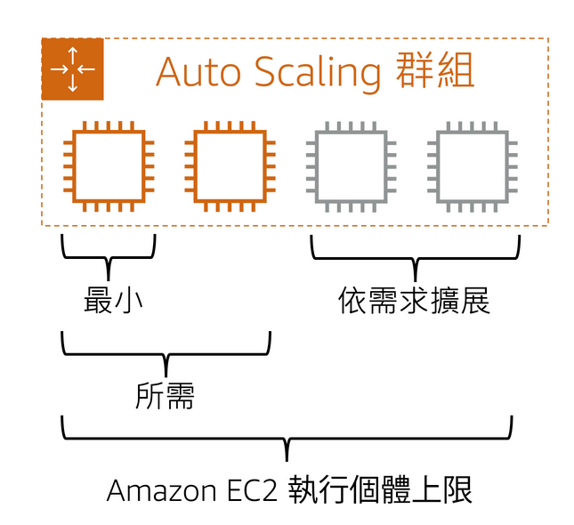
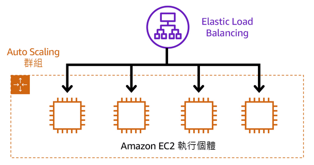
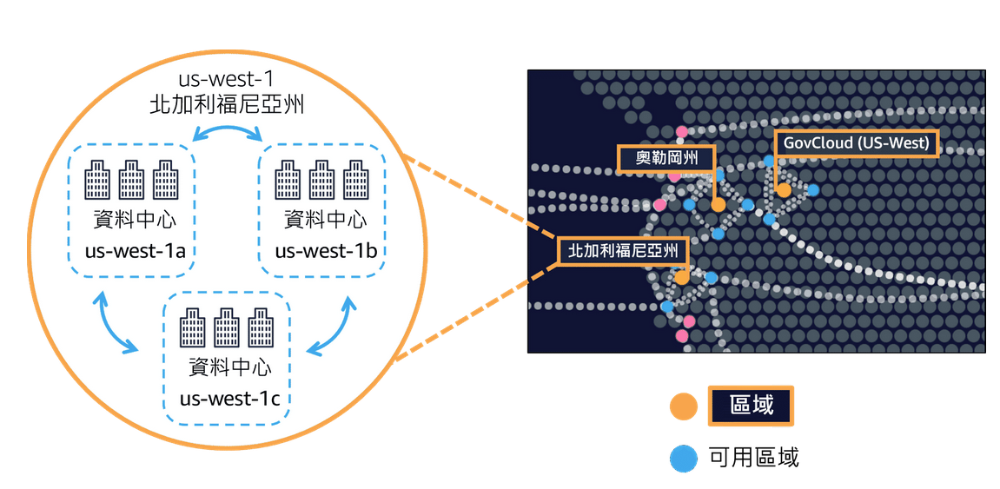
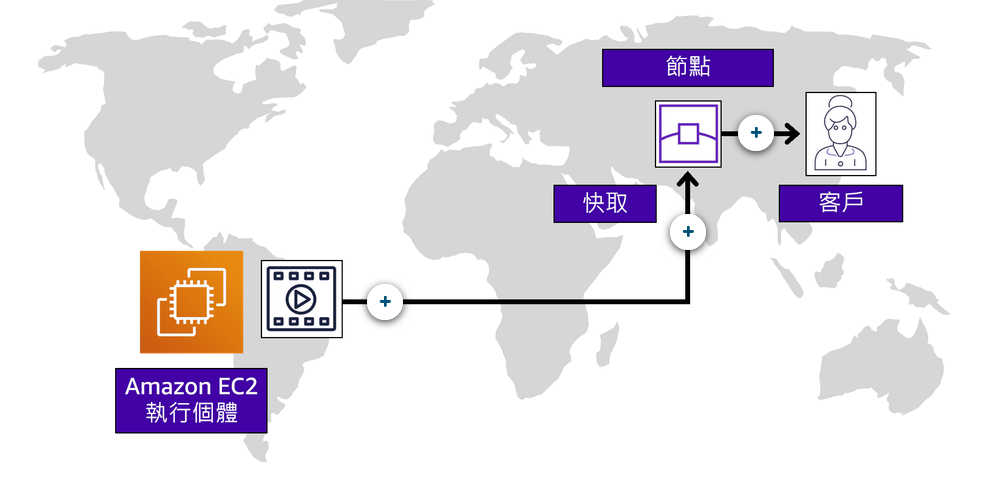
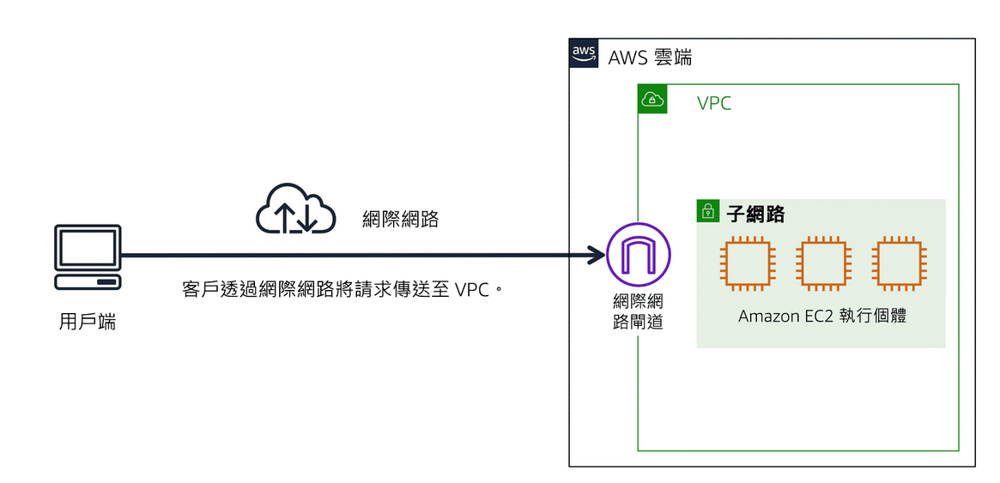
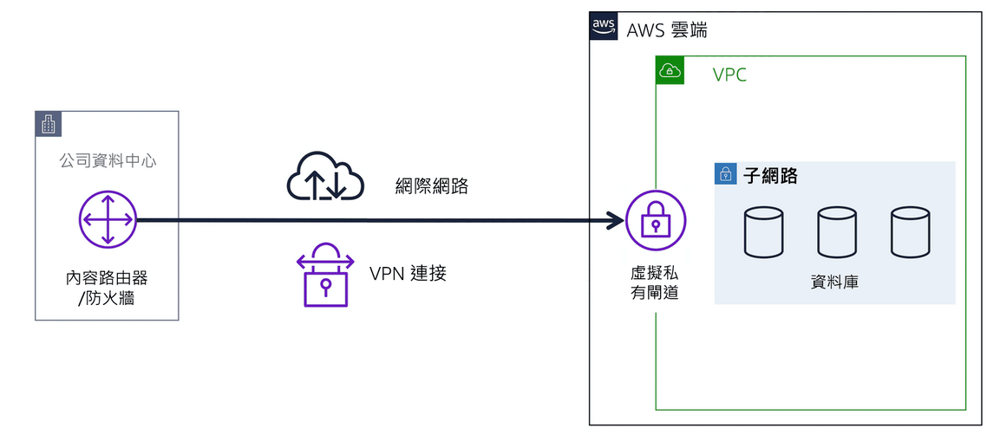
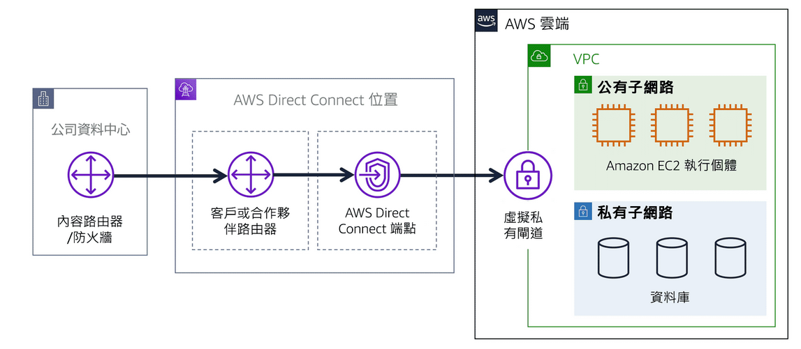
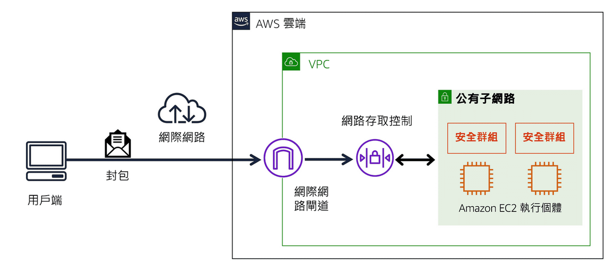
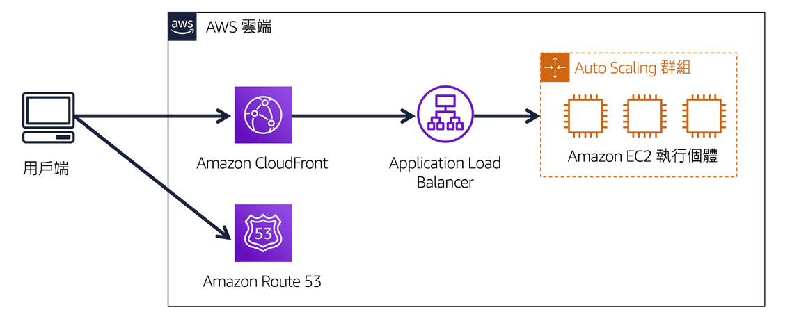

# AWS Cloud Practitioner
# Amazon Web Services簡介
## 用戶端 - 伺服器模型

### 雲端運算的部署模型

- ***雲端部署*** - 在雲端中執行完整的應用程式。 
- ***內部部署*** - 透過虛擬化和資源管理工具來部署資源。
- ***混合部署*** - 將雲端資源連接到內部部署基礎設施。

### 雲端運算的優勢
- 將預付費用轉變成變動費用
- 不必將資金花費在執行和維護資料中心上
- 無需猜測容量
- 受益於大範圍規模經濟
- 提高速度和敏捷性
- 快速進入全球市場

# 雲端中的運算
## Amazon EC2 執行個體類型
- ***一般用途*** - 一般用途的執行個體可平衡運算、記憶體與網路資源，也可用於各種工作負載。
- ***運算優化*** - 運算最佳化的執行個體非常適合運算密集型應用，這類應用可受惠於高效能處理器。
- ***記憶體最佳化*** - 記憶體最佳化執行個體是為交付於記憶體內部處理大型資料集之工作負載的快速效能而設計的。
- ***儲存最佳化*** - 最佳化儲存執行個體專為需要對本機儲存上的超大型資料集進行高序列讀取及寫入存取的工作量所設計，這些執行個體經過最佳化，能為應用程式提供每秒數萬次低延遲隨機的 I/O 操作 (IOPS)。
- ***加速運算執行個體*** - 使用硬體加速器或協同處理器來提高執行某些功能的效率，適合圖形應用程式、遊戲串流和應用程式串流等。

## Amazon EC2 定價
- ***隨需執行個體*** - 不可中斷的短期不定期工作負載，無需預付費用或最低合約。按照使用的運算時間付費。
- ***Amazon EC2 Savings Plans*** - 承諾在 1 年或 3 年期限內維持一致的運算用量，以此降低運算成本。這種限期承諾比起隨需付費，可節省高達 72% 的成本。
- ***預留執行個體*** - 一種計費折扣方式，依您帳戶中的隨需執行個體用量而定。
- ***Spot執行個體*** - 適合啟動和結束時間較彈性或可承受中斷的工作負載。Spot 執行個體利用未使用的 Amazon EC2 運算容量，節省最多達 90% 的成本。
- ***專用主機*** - 完全專供您使用且含有 Amazon EC2 執行個體容量的實體伺服器。 

## Amazon EC2 Auto Scaling
在 Amazon EC2 Auto Scaling 中，您可以使用兩種方法：動態擴展和預測性擴展。
- ***動態調整*** - 可因應不斷變化的需求， 
- ***預測性擴展*** - 則會根據預測的需求自動安排適當數量的 Amazon EC2 執行個體。
 

## Elastic Load Balancing
Elastic Load Balancing 是一種可在多個資源 (例如 Amazon EC2 執行個體) 之間自動分配傳入應用程式流量的 AWS 服務。

## AWS 內建服務
- ***Amazon Simple Notification Service (Amazon SNS)*** - 發布/訂閱服務，將訊息發布給訂閱者。
- ***Amazon Simple Queue Service (Amazon SQS)*** - 訊息佇列服務，應用程式會將訊息傳送到佇列中。使用者或服務會從佇列擷取訊息。
- ***AWS Lambda*** - 無需佈建或管理伺服器即可執行程式碼的服務，只需根據所用運算時間付費。
- ***Amazon Elastic Container Service (Amazon ECS)*** - 可高度擴展的高效能容器管理系統，支援 Docker 容器。
- ***Amazon Elastic Kubernetes Service (Amazon EKS)*** -  AWS 上執行 Kubernetes。
- ***AWS Fargate*** - 是無伺服器，依用量計費的運算引擎，讓您專注於建置應用程式，而無需管理伺服器。AWS Fargate 與 Amazon Elastic Container Service (ECS) 和 Amazon Elastic Kubernetes Service (EKS) 相容。

# 全球基礎設施與可靠性

- ***區域(Regions)*** - 各個區域為獨立的地理區域。
- ***可用區域(Availability Zones)*** - 可用區域是每個區域內的多個隔離位置。

## 選取區域
- 符合資料管理和法律要求
- 接近您的客戶
- 區域內的可用服務
- 定價

## Amazon CloudFront
Amazon CloudFront 用***節點***來將您內容的快取副本存放在更靠近客戶位置的站點，以便加快交付。

## AWS 管理工具
- ***AWS管理主控台(AWS Management Console)***
- ***AWS 命令列界面 (AWS CLI)***
- ***軟體開發套件 (SDK)***
- ***AWS Elastic Beanstalk*** - 提供程式碼和組態設定後，自動部署資源(調整容量、負載平衡、自動擴展、應用程式運作狀態監控)。
- ***AWS CloudFormation*** - 將基礎設施當作程式碼來處理。透過撰寫程式碼行來建立環境，無需使用 AWS 管理主控台個別佈建資源。

# 網路功能
## 公開網路連線

## VPN連線

## AWS Direct Connect(專用私有連線)

## VPC 中的網路流量控管
- ***子網路(Subnets)*** - VPC內部可以再切分**公有子網路**、**私有子網路**。
- ***網路存取控制清單 (ACL)*** - 作用在子網路上(Subnets)上，**無狀態**，預設允許所有傳入和傳出流量。
- ***安全群組*** - 作用在EC2上，**狀態**封包篩選，預設拒絕所有傳入流量，並允許所有傳出流量。

## Amazon Route 53 
Amazon Route 53 是一種 DNS Web 服務。 這項服務為開發人員和企業提供可靠的方式，將最終使用者路由到 AWS 託管的網際網路應用程式。

# 儲存
- ***執行個體存放區(EC2 instance store)*** - EC2 卸載資料會**消失**
- ***Amazon Elastic Block Store (Amazon EBS)*** - EC2 卸載資料會**保存**，可建立**EBS快照**進行增量備份。
- ***Amazon Simple Storage Service (Amazon S3)*** - 物件層級，每個物件均由資料、中繼資料和一組金鑰組成。提供多種儲存類別。
- ***Amazon Elastic File System (Amazon EFS)*** - 檔案層級，與區塊儲存和物件儲存相比，檔案儲存非常適合需要同時存取相同資料的大量服務和資源的使用案例。

## Amazon EBS 和 Amazon EFS 差異
EBS 只能在**同區域(Regions)** 的EC2，EFS 可以跨多個**區域(Regions)**

## Amazon S3 種類
- ***S3 Standard*** - 經常存取、備份三個可用區域、成本較高。
- ***S3 Standard-IA*** - 不常存取、備份三個可用區域、儲存價格低、擷取價格高。
- ***S3 One Zone-IA*** - 不常存取、一個可用區域、儲存價格比 Standard-IA 低、存放可輕易復原的資料。
- ***S3 Intelligent-Tiering*** - 適合存取模式未知或持續變更的資料，30天未存取搬移到Standard-IA。Standard-IA 資料被存取搬移到S3 Standard。
- ***S3 Glacier*** - 資料封存用，能夠在幾分鐘到幾小時內擷取物件，成本低。
- ***S3 Glacier Deep Archive*** - 資料封存用，能夠在 12 小時內擷取物件，成本最低。

# 資料庫
- ***Amazon Relational Database Service (Amazon RDS)*** - 關聯式資料庫，提供以下種類:Amazon Aurora 、PostgreSQL 、MySQL 、MariaDB 、Oracle 、SQL Server。
- ***Amazon Aurora*** - AWS自家關聯式資料庫。與 MySQL 和 PostgreSQL 相容。
- ***Amazon DynamoDB*** - 鍵值資料庫，提供 DAX 快取。無伺服器的服務，不需要佈建、修補或管理伺服器。 不需安裝、維護或操作軟體。提供 DAX 快取
- ***Amazon Redshift***- 大數據分析的資料倉儲。
- ***AWS Database Migration Service (AWS DMS)*** - 遷移關聯式資料庫、非關聯式資料庫和其他類型的資料存放區。
- ***Amazon DocumentDB*** - 是一種支援 MongoDB 工作負載的文件資料庫服務。(MongoDB 是一種文件資料庫程式。)
- ***Amazon Neptune*** - 圖形資料庫服務。 
- ***Amazon Quantum Ledger Database (Amazon QLDB)*** - 總帳資料庫服務。 紀錄應用程式資料所做的所有變更完整記錄。
- ***Amazon Managed Blockchain*** - 使用開放原始碼架構來建立和管理區塊鏈網路。 
- ***Amazon ElastiCache*** - 資料庫快取層，能夠協助改善常見要求的讀取時間。支援 Redis 和 Memcached。
- ***Amazon DynamoDB Accelerator (DAX)*** - DynamoDB 的記憶體內快取。改善回應時間，從不到 10 毫秒縮短到數微秒。

