# AWS Cloud Practitioner
# Amazon Web Services簡介
## AWS Well-Architected
雲端設計和執行的工作負載關鍵概念、設計原則和架構最佳實務。
- `卓越營運(Operational Excellence)` - 執行和監控系統，並持續改善流程與程序。
- `安全性(Security)` - 保護資訊與系統。重要主題包括資料機密性與完整性，管理使用者許可，以及建立控制來偵測安全事件。
- `可靠性(Reliability)` - 執行其預期功能的工作負載以及如何從故障中快速恢復以滿足需求。
- `效能效率(Performance Efficiency)` - IT 和運算資源的結構化和精簡分配。
- `成本最佳化(Cost Optimization)` - 專注於避免不必要的成本。
- `永續發展(Sustainability)` - 執行雲端工作負載的環境影響降至最低。

## 雲端運算的部署模型
- `雲端部署` - 在雲端中執行完整的應用程式。 
- `內部部署` - 透過虛擬化和資源管理工具來部署資源。
- `混合部署` - 將雲端資源連接到內部部署基礎設施。

## 雲端運算的優勢
- 將預付費用轉變成變動費用
- 不必將資金花費在執行和維護資料中心上
- 無需猜測容量
- 受益於大範圍規模經濟
- 提高速度和敏捷性
- 快速進入全球市場

# 雲端中的運算
Amazon Elastic Compute Cloud (Amazon EC2) 是一種 Web 服務，可在雲端提供安全、可調整大小的運算容量。
## Amazon EC2 執行個體類型
- `一般用途` - 一般用途的執行個體可平衡運算、記憶體與網路資源，也可用於各種工作負載。
- `運算優化` - 運算最佳化的執行個體非常適合運算密集型應用，這類應用可受惠於高效能處理器。
- `記憶體最佳化` - 記憶體最佳化執行個體是為交付於記憶體內部處理大型資料集之工作負載的快速效能而設計的。
- `儲存最佳化` - 最佳化儲存執行個體專為需要對本機儲存上的超大型資料集進行高序列讀取及寫入存取的工作量所設計，這些執行個體經過最佳化，能為應用程式提供每秒數萬次低延遲隨機的 I/O 操作 (IOPS)。
- `加速運算執行個體` - 使用硬體加速器或協同處理器來提高執行某些功能的效率，適合圖形應用程式、遊戲串流和應用程式串流等。

## Amazon EC2 定價
- `隨需執行個體` - 不可中斷的短期不定期工作負載，無需預付費用或最低合約。按照使用的運算時間付費。
- `Amazon EC2 Savings Plans` - 承諾在 1 年或 3 年期限內維持一致的運算用量，以此降低運算成本。這種限期承諾比起隨需付費，可節省高達 72% 的成本。
- `預留執行個體` - 一種計費折扣方式，依您帳戶中的隨需執行個體用量而定。
- `Spot執行個體` - 適合啟動和結束時間較彈性或可承受中斷的工作負載。Spot 執行個體利用未使用的 Amazon EC2 運算容量，節省最多達 90% 的成本。
- `專用主機(Dedicated Hosts)` - 完全專供您使用且含有 Amazon EC2 執行個體容量的實體伺服器。 

## Amazon EC2 Auto Scaling
在 Amazon EC2 Auto Scaling 中，您可以使用兩種方法：動態擴展和預測性擴展。
- `動態調整` - 可因應不斷變化的需求， 
- `預測性擴展` - 則會根據預測的需求自動安排適當數量的 Amazon EC2 執行個體。
 

## Elastic Load Balancing
Elastic Load Balancing 是一種可在多個資源 (例如 Amazon EC2 執行個體) 之間自動分配傳入應用程式流量的 AWS 服務。

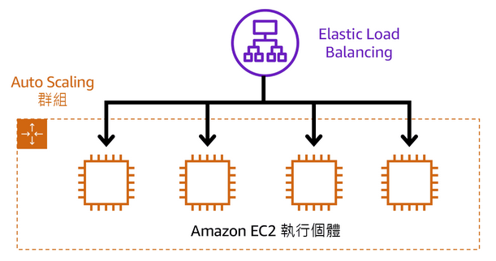

## AWS 內建服務
- `Amazon Simple Notification Service (Amazon SNS)` - 發布/訂閱服務，將訊息發布給訂閱者。
- `Amazon Simple Queue Service (Amazon SQS)` - 訊息佇列服務，應用程式會將訊息傳送到佇列中。使用者或服務會從佇列擷取訊息。
- `AWS Lambda` - `無伺服器`、`事件推動`的運算服務，無需佈建或管理伺服器即可執行程式碼的服務，只需根據所用`運算時間付費`。
- `Amazon Elastic Container Service (Amazon ECS)` - 可高度擴展的高效能容器管理系統，支援 `Docker` 容器。
- `Amazon Elastic Kubernetes Service (Amazon EKS)` -  AWS 上執行 `Kubernetes`。
- `AWS Fargate` - 是`無伺服器`，依`用量計費`的運算引擎，讓您專注於建置應用程式，而無需管理伺服器。AWS Fargate 與 Amazon Elastic Container Service (ECS) 和 Amazon Elastic Kubernetes Service (EKS) 相容。

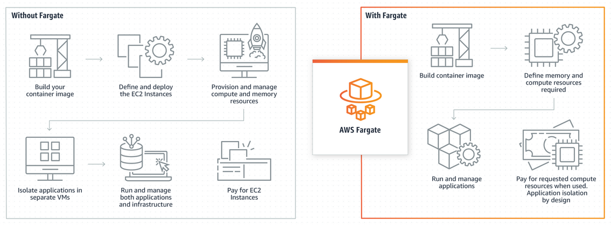

# 全球基礎設施與可靠性

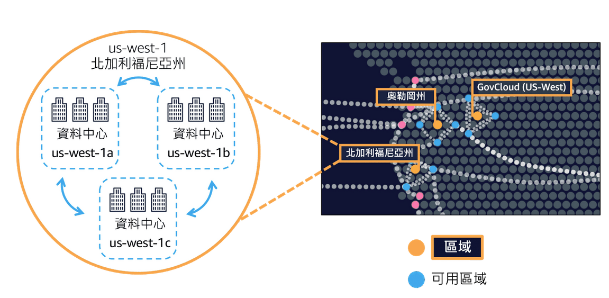

- `區域 (Regions)` - 獨立的`地理區域`。
- `可用區域 (Availability Zones)` - 每個`區域`內的多個`隔離位置`。

## 選取區域
- 符合資料管理和法律要求
- 接近您的客戶
- 區域內的可用服務
- 定價

## Amazon CloudFront
Amazon CloudFront 用`節點`來將您內容的快取副本存放在更靠近客戶位置的站點，以便加快交付。
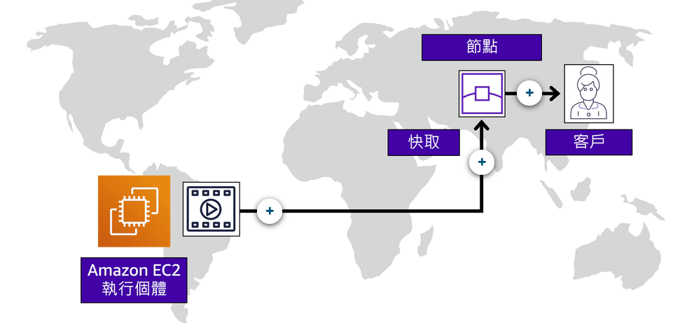

## AWS Global Accelerator
AWS Global Accelerator 是一種網路服務，可協助您提高公開應用程式的可用性、效能和安全性。
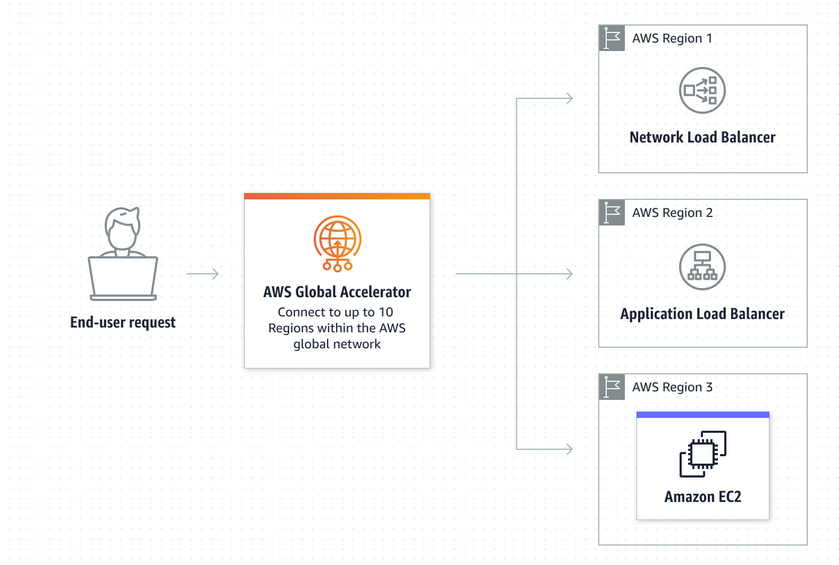

## AWS Global Accelerator 與 Amazon CloudFront 有何不同
AWS Global Accelerator 和 Amazon CloudFront 是兩種獨立的服務，都使用 AWS 全域網路及其全球節點。CloudFront 同時改進了可快取內容 (例如，影像和影片) 和動態內容 (例如，API 加速和動態網站交付) 的效能。Global Accelerator 可透過 TCP 或 UDP 提高各種應用程式的效能，方式是將邊緣的封包代理至一或多個 AWS 區域中執行的應用程式。Global Accelerator 非常適用於非 HTTP 使用案例，如遊戲 (UDP)、IoT (MQTT) 或 IP 語音，也非常適用於特別需要靜態 IP 地址或確定性快速區域容錯移轉的 HTTP 使用案例。這兩種服務與 AWS Shield 整合來提供 DDoS 防護。

## AWS 管理工具
- `AWS管理主控台 (AWS Management Console)`
- `AWS 命令列界面 (AWS CLI)`
- `軟體開發套件 (SDK)`
- `AWS Elastic Beanstalk` - 提供程式碼和組態設定後，自動部署資源(`調整容量`、`負載平衡`、`自動擴展`、`應用程式運作狀態監控`)。
- `AWS CloudFormation` - 將基礎設施當作程式碼來處理。透過撰寫程式碼行來建立環境，無需使用 AWS 管理主控台個別佈建資源。

# 網路功能
- `Amazon Virtual Private Cloud (Amazon VPC)` - 邏輯隔離虛擬網路中啟動 AWS 資源。
- `VPC Flow Logs` - 紀錄進出VPC的IP資訊。
- `VPC peering` - 用來串聯 `VPC` 的網路連線。

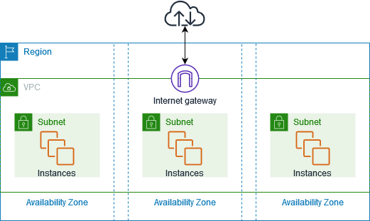
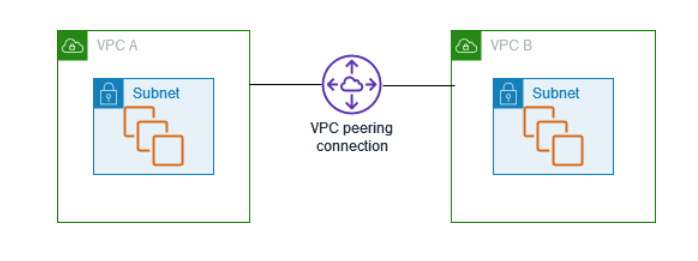
## 公開網路連線
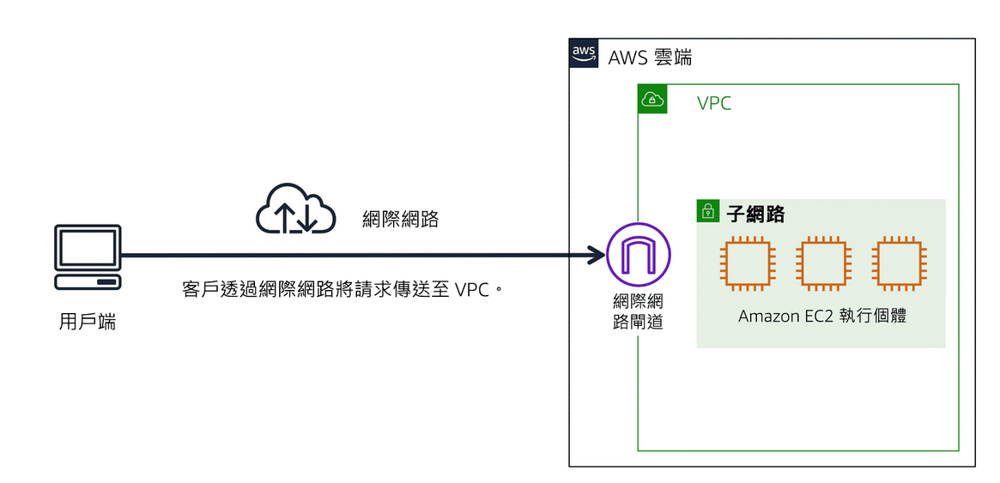
## VPN連線
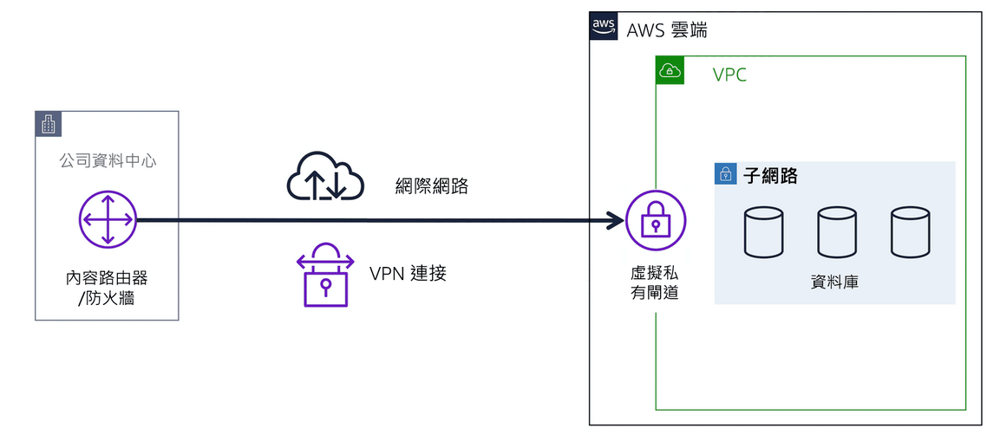
## AWS Direct Connect(專用私有連線)

## VPC 中的網路流量控管
- `子網路 (Subnets)` - VPC內部可以再切分`公有子網路`、`私有子網路`。
- `網路存取控制清單 (ACL)` - 作用在子網路上(Subnets)上，`無狀態`，預設允許所有傳入和傳出流量(`黑名單`)。
- `安全群組` - 作用在EC2上，`狀態`封包篩選，預設拒絕所有傳入流量(`白名單`)，並允許所有傳出流量。

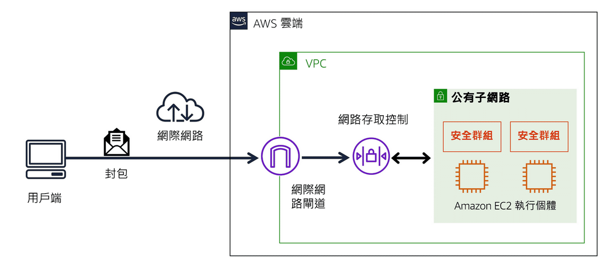
## Amazon Route 53 
Amazon Route 53 是一種 DNS Web 服務。 這項服務為開發人員和企業提供可靠的方式，將最終使用者路由到 AWS 託管的網際網路應用程式。
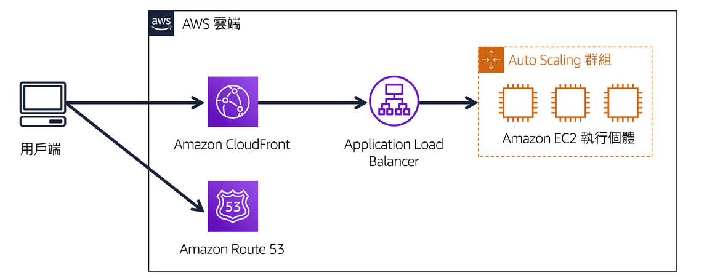

# 儲存
EC2 
- `執行個體存放區 (EC2 instance store)` - EC2 卸載資料會`消失`。
- `Amazon Elastic Block Store (Amazon EBS)` - EC2 卸載資料會`保存`，可建立`EBS快照`進行增量備份。 

跨AZ
- `Amazon Elastic File System (Amazon EFS)` - `檔案層級`，與區塊儲存和物件儲存相比，檔案儲存非常適合需要同時存取相同資料的大量服務和資源的使用案例。

跨Regions
- `Amazon Simple Storage Service (Amazon S3)` - `物件層級`，每個物件均由資料、中繼資料和一組金鑰組成。提供多種儲存類別。

## Amazon EBS 和 Amazon EFS 差異
EBS只能在一個EC2上使用，EFS 可以跨多個`可用區域 (Availability Zones)`，同時讓多個EC2使用。
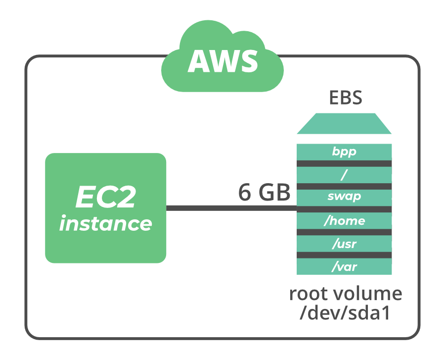
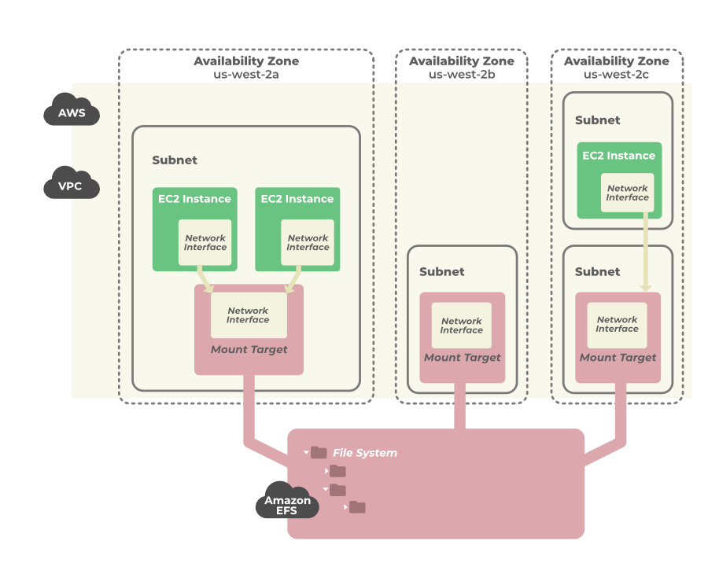

## Amazon S3 種類
Amazon S3 是一個`物件`儲存服務，提供領先業界的可擴展性、資料可用性、安全性及效能。可用`Athena`用SQL查詢S3中的資料。
- `S3 Standard` - 經常存取、資料同時存放`三個`可用區域、成本較高。
- `S3 Standard-IA` - 不常存取、資料同時存放`三個`可用區域、儲存價格低、擷取價格高。
- `S3 One Zone-IA` - 不常存取、資料只放在`一個`可用區域、儲存價格比 Standard-IA 低、存放可輕易復原的資料。
- `S3 Intelligent-Tiering` - 適合存取模式未知或持續變更的資料，`30天`未存取搬移到Standard-IA。Standard-IA 資料被存取搬移到S3 Standard。
- `S3 Glacier` - 資料封存用，能夠在`幾分鐘到幾小時`內擷取物件，成本低。
- `S3 Glacier Deep Archive` - 資料封存用，能夠在` 12 小時`內擷取物件，成本最低。
- `AWS Snow 系列` - 是實體裝置的集合，可協助以實體方式將 EB 級資料輸出入 AWS。
  - Snowcone  - 是小型、堅固且安全的邊緣運算與資料傳輸裝置。
  - Snowball
    - Snowball Edge Storage Optimized - 非常適用於大規模資料遷移以及週期性傳輸工作流程，與具較高容量需求的本機運算。
    - Snowball Edge Compute Optimized - 為機器學習、全動態影片分析、分析以及本機運算堆疊提供了強大的運算資源。
  - AWS Snowmobile - 可傳輸高達 100 PB(Exabyte EB 級別) 的資料。
# 資料庫
- `Amazon Relational Database Service (Amazon RDS)` - 關聯式資料庫。
  - Amazon Aurora - AWS自家關聯式資料庫。與 MySQL 和 PostgreSQL 相容。
  - PostgreSQL
  - MySQL
  - MariaDB
  - Oracle
  - SQL Server
- `Amazon DynamoDB` - 鍵值資料庫，提供 DAX 快取。無伺服器的服務，不需要佈建、修補或管理伺服器。 不需安裝、維護或操作軟體。提供 DAX 快取
- `Amazon Redshift`- 大數據分析的資料倉儲。
- `AWS Database Migration Service (AWS DMS)` - 遷移關聯式資料庫、非關聯式資料庫和其他類型的資料存放區。
- `Amazon DocumentDB` - 是一種支援 MongoDB 工作負載的文件資料庫服務。(MongoDB 是一種文件資料庫程式。)
- `Amazon Neptune` - 圖形資料庫服務。 
- `Amazon Quantum Ledger Database (Amazon QLDB)` - 總帳資料庫服務。 紀錄應用程式資料所做的所有變更完整記錄。
- `Amazon Managed Blockchain` - 使用開放原始碼架構來建立和管理區塊鏈網路。 
- `Amazon ElastiCache` - 資料庫快取層，能夠協助改善常見要求的讀取時間。支援 `Redis` 和 `Memcached`。
- `Amazon DynamoDB Accelerator (DAX)` - DynamoDB 的記憶體內快取。改善回應時間，從不到 10 毫秒縮短到數微秒。

## AWS Storage Gateway
AWS Storage Gateway 是一種混合雲端儲存服務，提供接近無限的雲端儲存內部部署存取。
- 標準儲存通訊協定 - Storage Gateway 使用 NFS、SMB、iSCSI 或 iSCSI-VTL 無縫連接本機生產或備份應用程式。
- 全受管快取 - 本機閘道設備會保留最近寫入或讀取之資料的快取，讓您的應用程式可透過低延遲的方式存取長期存放在 AWS 的資料。
- 優化和保全資料傳輸 - Storage Gateway 使用 SSL 安全地上傳變更的資料和下載請求的資料，以及加密任何閘道設備類型和 AWS 之間傳輸的資料。

# 安全責任
## 共同責任模型(Shared Responsibility Model)
- 客戶 - 必須負責在 AWS 雲端中建立和放置的所有內容的安全。
- AWS - 負責維護雲端本身的安全。

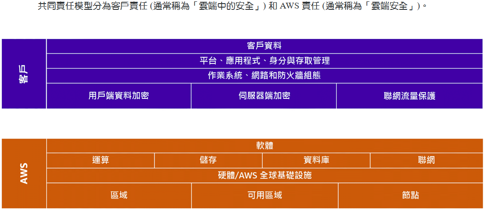

## 其他安全功能
- `Identity and Access Management (IAM)` - 管理 AWS 服務與資源的存取權。可用 `Access keys 物件(包含 access key ID + secret access key)` 提供程式化管理
  - `IAM` - 可設定：使用者、群組、角色
  - `IAM 政策` - 允許或拒絕 AWS 服務和資源許可的文件。
  - `Multi-Factor Authentication (MFA)` - 多重因素驗證
- `AWS Organizations` - 使用服務控制政策 (SCP) 集中控制組織中帳戶的許可。SCP 能讓您限制每個帳戶中使用者和角色可以存取的 AWS 服務、資源和個別 API 動作。
- `AWS Artifact` - 存取 AWS 安全與合規報告和選取線上協議的服務。
  - `AWS Artifact agreement (協議)` - 公司需要與 AWS 簽署使用特定類型資訊的協定。
  - `AWS Artifact report (報告)` - 提供來自第三方稽核人員的合規報告。
- `AWS Shield` - 防禦 DDoS 攻擊的服務。
  - `AWS Shield Standard` - 免費服務，自動保護所有 AWS 客戶。 
  - `AWS Shield Advanced` - 付費服務，可提供詳細的攻擊診斷，和偵測與減輕複雜的 DDoS 攻擊。 
- `AWS Key Management Service (AWS KMS)` - 建立、管理和使用加密金鑰。
- `AWS WAF` - Web 應用程式防火牆，可讓您監控進入 Web 應用程式的網路要求。 
- `Amazon Inspector` - 自動安全評估服務，有助於提高部署在 AWS 上的應用程序的安全性和合規性。`自動評估應用程序的風險`、`漏洞`和與最佳實踐的偏差。
- `Amazon GuardDuty` - 威脅檢測服務，可以`持續監控惡意`或`未經授權的行為`，以幫助您保護您的 AWS 賬戶和工作負載。

# 監控和分析
- `Amazon CloudWatch` - 監控和管理各種指標，並根據這些指標的資料設定警示動作。
  - `CloudWatch 警示` - 指標值超過或低於預先定義的閾值時自動執行動作。
  - `CloudWatch 儀表板` - 從單一位置存取資源的所有指標。
- `AWS CloudTrail` - 記錄帳戶的 API 呼叫。包括 API 呼叫者的身分、API 呼叫的時間、API 呼叫者的來源 IP 位址等。
  - `CloudTrail Insights` - 選用功能，可讓 CloudTrail 自動偵測 AWS 帳戶中不尋常的 API 活動。 
- `AWS Trusted Advisor` - AWS Trusted Advisors 提供可幫助您遵循 AWS 最佳實踐的建議。優化您的服務和資源。 。
  - `成本最佳化 (Cost optimization)`  - 透過`分析用量`、`組態`和`支出`，採用可行的推薦來協助您`節省成本`。範例包括識別空閒的 RDS 資料庫執行個體、未充分利用的 EBS 磁碟區、未關聯的彈性 IP 地址，以及 Lambda 函數中的過多逾時。
  - `效能 (Performance)` - 透過分析用量和組態，提供可行的推薦來協助改善服務效能。範例包括分析 EBS 輸送量和延遲、EC2 執行個體的運算用量，以及 CloudFront 上的組態。
  - `安全性 (Security)` - 透過推薦由安全專家策管的基本安全最佳實務，來協助改善 AWS 環境的安全性。範例識別 RDS 安全群組存取風險、存取資料外洩和不必要的 S3 儲存貯體許可。
  - `容錯能力 (Fault tolerance)` - 協助您`改善服務的可靠性`。範例包括檢查 Auto Scaling EC2 群組、刪除 Route 53 上的運作狀態檢查、停用可用區域，以及停用 RDS 備份。
  - `服務配額/服務限制 (Service quotas / Service limit)` - 服務配額意指您可以在 AWS 帳戶中建立的資源數量上限。 AWS 實作配額為所有客戶提供高度可用且可靠的服務，並讓您免於支付不必要的開支。如果您達到超過 `80% 的服務配額`，則 Trusted Advisor 會`通知`您。然後，您可以按照推薦刪除資源或請求增加配額。此值取決於快照，所以您目前的用量可能有所不同。限制和用量資料最多可能需要 24 小時才能反映任何變更。

# 定價
- `AWS 免費方案`
  - 永遠免費。
  - 12 個月免費。
  - 試用。
- `AWS 定價` 
  - 按實際用量付費。
  - 預留容量，付費越少，例如：Amazon EC2 RI。
  - 以量計算的折扣，讓您用量越多付費越少。
- `AWS 定價計算器(Pricing Calculator)` - 讓您可以探索 AWS 服務，並為您在 AWS 的使用案例成本建立評估。
- `AWS 帳單儀表板 (AWS Billing)` - 支付 AWS 帳單、監控用量，以及分析和控制成本。
- `合併帳單 (Consolidated Billing)` - 能在組織中帳戶中`共用大量折扣`定價、Savings Plans 和預留執行個體。
- `AWS 預算 (AWS Budgets)`- 建立`預算來規劃`服務用量、服務成本和執行個體保留。用量超過 (或預測會超過) 預算金額時設定`自訂提醒`。
- `AWS 成本總管 (Cost Explorer)` - 了解和管理`隨著時間推進` AWS 成本和用量的工具。
- `Total Cost of Ownership (Cloud TCO)` - 提供企業比較`本地資料中心(on-premises)`跟遷移到`AWS`的成本差異工具。

## Amazon EC2 預留執行個體(Amazon EC2 Reserved Instances)
相較於隨需定價，Amazon EC2 預留執行個體 (RI) 提供了大幅折扣 (最高可達 72%)，並在特定的可用區域使用時提供容量保留功能。
- `標準 RI` - 這些執行個體提供了最大幅的折扣 (最高可達隨需定價的 72%)，而且最適合用於`穩定狀態的用量`。
- `可轉換 RI` - 這些執行個體提供了折扣 (最高可達隨需定價的 54%)，並且能夠變更 RI 的屬性，但交換的結果必須能夠建立等值或更高數值的預留執行個體。如同標準 RI，可轉換 RI 非常適合`穩定狀態的用量`。
- `排程的 RI` - 這些執行個體可以在您預訂的時段內啟動。這個選項可讓您按照可預期的重複排程 (只需要每天、每星期或每月的某個時段) 來`排定容量保留`。

# AWS Support 計劃
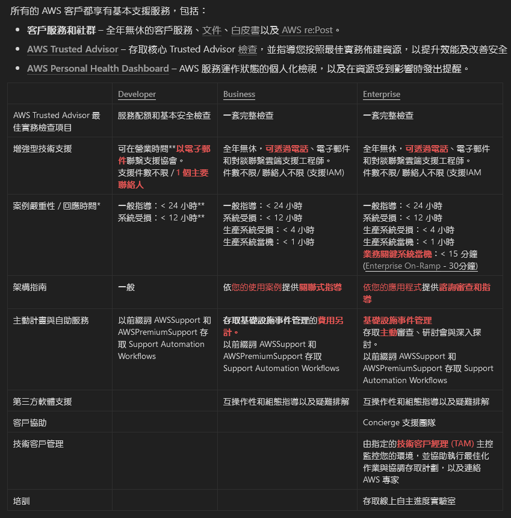

# 其他功能
- AWS Marketplace - 使用 AWS Marketplace 尋找、測試和購買能在 AWS 上執行的軟體。
- AWS Directory Service - AWS SSO Tool
- AWS Config - a service that enables you to assess, audit, and evaluate the configurations of your AWS resources.
- AWS CloudFormation - provides a common language for you to describe and provision all the infrastructure resources in your cloud environment. CloudFormation allows you to use a simple text file to model and provision, in an automated and secure manner, all the resources needed for your applications across all regions and accounts. This file serves as the single source of truth for your cloud environment.
- AWS OpsWorks - 讓您使用程式碼自動設定伺服器組態的自動化平台。 lets you use Chef and Puppet to automate how servers are configured, deployed, and managed across your Amazon EC2 instances or `on-premises compute environments`
- AWS CodeDeploy - 自動部屬工具。 a fully managed deployment service that automates software deployments to a variety of compute services such as Amazon EC2, AWS Fargate, AWS Lambda, and your `on-premises servers`.

# 少考
- AWS Cost and Usage report - bthe most granular data about your AWS costs and usage
- AWS CodeCommit - AWS 提供的程式碼版本控制工具
- Amazon Machine Image - a pre-configured Amazon Elastic Compute Cloud (Amazon EC2) instance
- Service Health Dashboard - the generic status of overall AWS services 
- Personal Health Dashboard - provides status of services pertaining to "subscribed" AWS services.客製化
- Amazon Rekognition - 只需提供影像或影片至 Amazon Rekognition API，服務即可辨識物件、人物、文字、場景與活動。也可偵測到任何不當內容。Amazon Rekognition 還提供高度精準的臉部分析、臉部比較與臉部搜尋功能。您可以偵測、分析及比對各種使用案例的臉部，包括驗證使用者、建立目錄、計算人數和公共安全。
- AWS CloudHSM (Hardware Security Module) - helps you meet corporate, contractual, and regulatory compliance requirements for data security by using dedicated Hardware Security Module (HSM) instances within the AWS cloud.
- Amazon Transcribe - 將語音轉換為文字
- Amazon Comprehend - 發現文字中的模式
- Amazon Fraud Detector - 識別潛在的線上詐騙活動
- Amazon Lex - 建立語音和文字 Chatbot
- SageMake - 快速建立、培訓和部署 機器學習(ML) 模型

# 遷移 
CCP不會考,可幫助理解該如何將專案轉移到雲端
## AWS Cloud Adoption Framework (AWS CAF) 遷移指引
  - `業務觀點` - 確保 IT 符合業務需求，讓 IT 投資可連結至關鍵業務成果。
  - `人員觀點` - 支援開發整個組織的變更管理策略，以確保成功採用雲端。
  - `治理觀點` - 著重於技能和流程，使 IT 策略與業務策略一致。這可以確保您將業務價值最大化，並將風險降至最低。
  - `平台觀點` - 包括在雲端上實作新解決方案，以及將內部部署工作負載遷移至雲端的原則和模式。
  - `安全觀點` - 可確保組織符合可見性、可稽核性、控制和敏捷性的安全目標。
  - `營運觀點` - 可協助您啟動、執行、使用、操作及恢復 IT 工作負載，達到與商業利益關係人說好的程度。
## 遷移策略
  - `重新託管` - 不用修改。
  - `平台重建` - 小改。
  - `重構/重新架構` - 用雲端原生功能重寫。
  - `重新購買` - 改買產品。
  - `保留` - 不轉移到雲端。
  - `淘汰` - 可以移除的功能。

